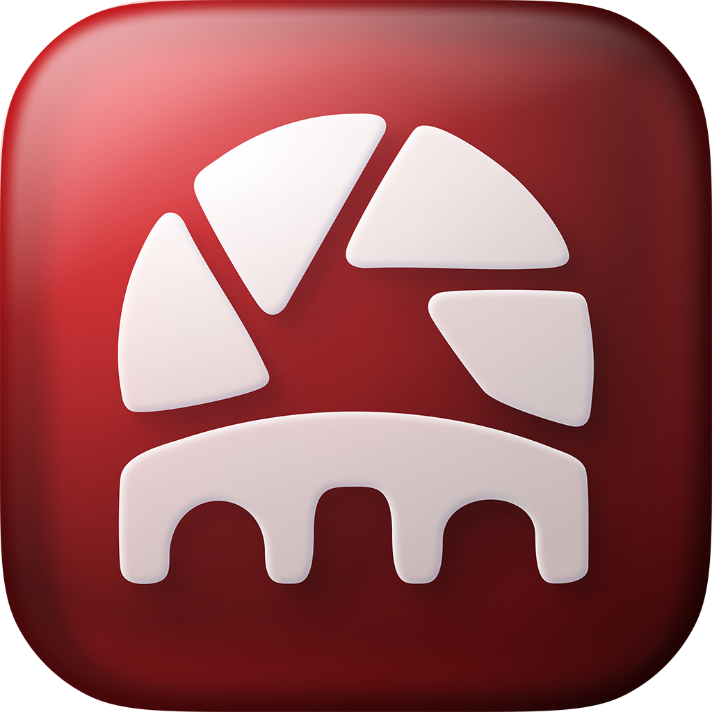

  
  <h1>Airlive Bridge</h1>
  
<b>Free &amp; open-source Mac app that turns iPhone camera feeds into a live multicam switcher — output to NDI, OBS, SRT &amp; RTSP, with remote camera control built in.</b>

  
  
  
  

---

Receive **Airlive Camera** (iPhone) streams on a Mac, **switch between them
(multicam)**, and re-publish the chosen PROGRAM to any production tool —
**NDI / OBS / SRT / RTSP** — with **remote camera control built in**.

One bridge turns several iPhone feeds into a live switcher with a standard output
every tool understands.

It incorporates the GPL-3.0 AirPlay receiver
[UxPlay](https://github.com/FDH2/UxPlay), so the whole app is GPL-3.0 — see
[`LICENSE`](LICENSE) and [`THIRD-PARTY-NOTICES.md`](THIRD-PARTY-NOTICES.md).

## Why

Downstream protocols (NDI/SRT/RTSP) are **one-way video out** — they can't send
control back to the iPhone. So remote control (ISO/WB/lens/tally…) lives **in
this app**. One bridge → works in vMix, ProPresenter, Wirecast, OBS, Resolume,
TouchDesigner, etc.

## Sources — what you can connect

Two kinds of iPhone source:

**Airlive Camera** (our iOS app) — the full path. Install it on the iPhone, pick a
channel, done. Connects over Wi-Fi (Bonjour `_airlive._tcp`) with two-way **remote
control** (ISO / shutter / white balance / lens / tally) and a cool, low-power
stream tuned for long shoots.

**Any AirPlay camera app** (e.g. **Blackmagic Camera**) — the universal path. On the
iPhone: Control Center → **Screen Mirroring** → pick the Bridge channel (shown as
`Cam N`). Works with any AirPlay-capable app. Note: Screen Mirroring sends whatever
is on the phone's screen, so use the app's own clean / external-output mode for a
frame without its on-screen UI. Video-only — no remote control on this path.

*(A wired **HDMI / USB capture device** can also be a channel.)*

Either way the source becomes a channel in the switcher, and the program feeds every
output — **NDI / OBS / SRT / RTSP / HDMI**.

## Model

- You **create channels** (receiver slots) — not a list of pre-found cameras.
  Each channel advertises Bonjour `_airlive._tcp`; the iPhone connects to the one
  you pick.  Channels carry an order index (`ord`) so the iPhone lists them in
  your Bridge order (drag-reorder), independent of their names.
- **Solo vs Multiview.**  *Solo* = one camera; the selected camera IS the program.
  *Multiview* = a broadcast switcher: PREVIEW (staged, green) + PROGRAM (on air,
  red) on top, all cameras as thumbnails below; **CUT** sends Preview → Program.
- **One program bus.**  The chosen program (selected camera in Solo, PGM in
  Multiview) feeds the **outputs** — created once, sent continuously, so switching
  the source never re-creates the sender (no flicker / re-discovery).
- Per channel: a live preview with a **hide-preview** toggle (don't render video
  you don't need — saves CPU/GPU) and camera control.

## Usage

1. **Add channels** (Channels rail `+`) — one per iPhone you'll connect.  On the
   iPhone, pick the matching channel; it shows **Available / Live**.
2. **Reorder** by dragging in the Channels list — the multiview grid and the
   iPhone's channel list both follow.
3. **Switch:** toggle **Solo ⇄ Multiview** in the title bar.  In Multiview, click
   a thumbnail to stage it in Preview, then **CUT** (Space) to take it to Program;
   double-click a thumbnail to hot-cut.  Selecting a channel on the left also
   stages it to Preview.
4. **Fullscreen Multicam** (button above the grid) opens a clean multiview wall in
   its own window — drag it to a second monitor.
5. **Publish** (Outputs rail `+`): add an **NDI** sender or an **OBS Airlive
   Bridge** relay (see Outputs).  The program publishes continuously.

## Outputs

- **NDI** — decodes the program and sends it as an NDI source; pick it up in OBS
  (via DistroAV), vMix, Resolume, TouchDesigner, etc.
- **OBS Airlive Bridge** — a **passthrough relay**: forwards the program's raw
  H.264 straight to the OBS plugin (zero re-encode, no extra load on the phone).
  In OBS, add the **"OBS Airlive Bridge"** source (the plugin's second source type,
  distinct from the direct-iPhone **"OBS Airlive"**).  On a CUT the Bridge asks the
  on-air camera for an instant keyframe so OBS resyncs immediately — but only when
  OBS is actually connected (the phone never emits a keyframe for nothing).
- ⏭ **SRT / RTSP / Virtual Camera** — planned (NDI + OBS shipped first).

## Shortcuts

In-app by default; flip **"Work in other apps"** (Input Monitoring) to fire them
globally with a fixed **⌃⌥** prefix (so they never hijack typing elsewhere).
Defaults: **Space** = Cut, **1–9** = camera → Program, **⇧1–6** = lens of the
focused camera.  Every action is **reassignable** — open the key icon in the title
bar, click a chip, press the new key (Esc cancels); conflicts are refused.

## Security

One optional **password** for the whole Bridge (title-bar lock / Channels footer).
Cameras must enter it to connect (per-connection HMAC challenge-response, no TLS —
it's LAN access control, not confidentiality).  Changing it forces connected
cameras to re-auth.  Stored in the macOS Keychain.

## Not in MVP

- ⏭ Virtual Camera — fast-follow
- ⏭ Windows (the vMix world) — later; NDI/SRT carry over, VCam differs

## Protocol (fixed — defined elsewhere)

ARLV over TCP (18-byte header, H.264 AVCC) + Bonjour `_airlive._tcp` + type-2
JSON control. **Frozen**, owned by the `airlive` repo. This repo adapts to it;
it never changes it.

## Reuse

Ports (copies) proven Swift from the Studio app for the Mac MVP:
`CamSlotReceiver` (receiver + Bonjour multi-slot + decode + jitter/playout +
control), `OutputSettings` (LatencyPreset), HaishinKit (RTMP/SRT). New work:
**NDI** (NDI SDK) and **RTSP** (small muxer/server).

## Boundaries

Standalone repo. The `airlive` camera / studio / AirliveCore code is **never
edited from here** — protocol or app-side changes are handed to the apps team to
avoid conflicts. Studio is read for reference / porting only.
